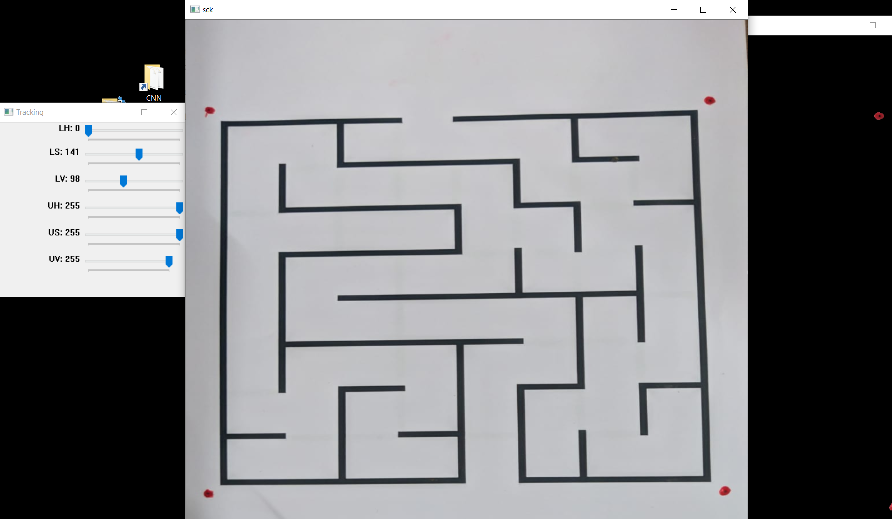

# genesis
Codes for maze solving 2-DOF arm 

This project involves a 2-DOF arm tracing the solution of a given maze.

This project can be split into three different parts the mechanics(the arm) , tronics(arduino and servo) and the image processing part(solving the maze given its image).

Below is an example of how we extract the path from a picture of the maze

The extracted information from the picture is displayed

 
